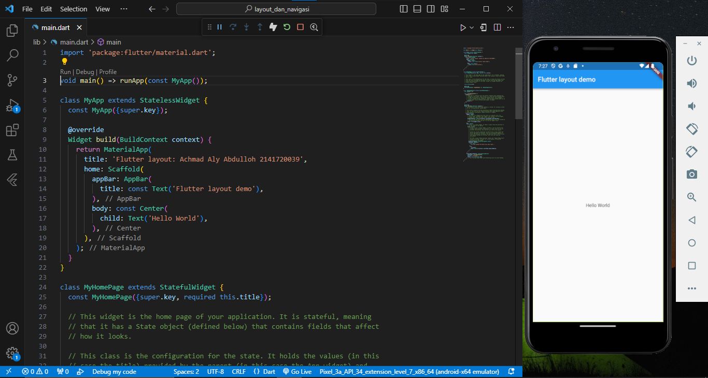
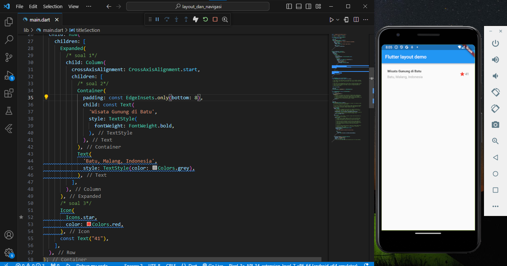
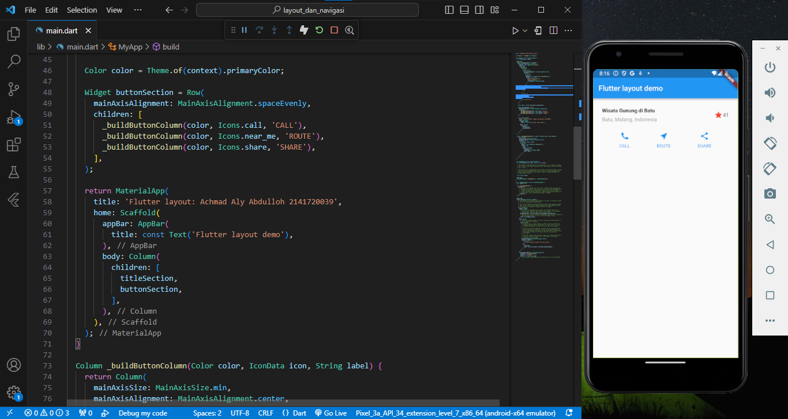
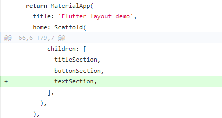
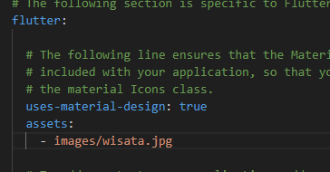
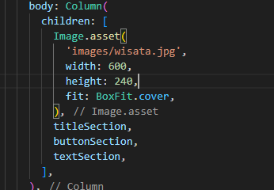
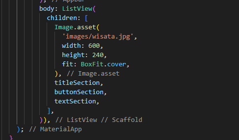

# layout_dan_navigasi

Nama : Achmad Aly Abdulloh
Nim : 2141720039
Kelas : TI-3A

## Praktikum 1: Membangun Layout di Flutter

### Langkah 1: Buat Project Baru
Buatlah sebuah project flutter baru dengan nama layout_flutter. Atau sesuaikan style laporan praktikum yang Anda buat.

### Langkah 2: Buka file lib/main.dart
Buka file main.dart lalu ganti dengan kode berikut. Isi nama dan NIM Anda di text title.

        import 'package:flutter/material.dart';

        void main() => runApp(const MyApp());

        class MyApp extends StatelessWidget {
        const MyApp({super.key});

        @override
        Widget build(BuildContext context) {
            return MaterialApp(
            title: 'Flutter layout: Nama dan NIM Anda',
            home: Scaffold(
                appBar: AppBar(
                title: const Text('Flutter layout demo'),
                ),
                body: const Center(
                child: Text('Hello World'),
                ),
            ),
            );
        }
        }

### Langkah 3: Identifikasi layout diagram

### Langkah 4: Implementasi title row
Pertama, Anda akan membuat kolom bagian kiri pada judul. Tambahkan kode berikut di bagian atas metode build() di dalam kelas MyApp:

        Widget titleSection = Container(
        padding: const EdgeInsets.all(...),
        child: Row(
            children: [
            Expanded(
                /* soal 1*/
                child: Column(
                crossAxisAlignment: ...,
                children: [
                    /* soal 2*/
                    Container(
                    padding: const EdgeInsets.only(bottom: ...),
                    child: const Text(
                        'Wisata Gunung di Batu',
                        style: TextStyle(
                        fontWeight: FontWeight.bold,
                        ),
                    ),
                    ),
                    Text(
                    'Batu, Malang, Indonesia',
                    style: TextStyle(...),
                    ),
                ],
                ),
            ),
            /* soal 3*/
            Icon(
            ...,
                color: ...,
            ),
            const Text(...),
            ],
        ),
        );

## Praktikum 2: Implementasi button row

### Langkah 1: Buat method Column _buildButtonColumn
Bagian tombol berisi 3 kolom yang menggunakan tata letak yang sama—sebuah ikon di atas baris teks. Kolom pada baris ini diberi jarak yang sama, dan teks serta ikon diberi warna primer.

Karena kode untuk membangun setiap kolom hampir sama, buatlah metode pembantu pribadi bernama buildButtonColumn(), yang mempunyai parameter warna, Icon dan Text, sehingga dapat mengembalikan kolom dengan widgetnya sesuai dengan warna tertentu.

        class MyApp extends StatelessWidget {
        const MyApp({super.key});

        @override
        Widget build(BuildContext context) {
            // ···
        }

        Column _buildButtonColumn(Color color, IconData icon, String label) {
            return Column(
            mainAxisSize: MainAxisSize.min,
            mainAxisAlignment: MainAxisAlignment.center,
            children: [
                Icon(icon, color: color),
                Container(
                margin: const EdgeInsets.only(top: 8),
                child: Text(
                    label,
                    style: TextStyle(
                    fontSize: 12,
                    fontWeight: FontWeight.w400,
                    color: color,
                    ),
                ),
                ),
            ],
            );
        }
        }

### Buat widget buttonSection

        Color color = Theme.of(context).primaryColor;

        Widget buttonSection = Row(
        mainAxisAlignment: MainAxisAlignment.spaceEvenly,
        children: [
            _buildButtonColumn(color, Icons.call, 'CALL'),
            _buildButtonColumn(color, Icons.near_me, 'ROUTE'),
            _buildButtonColumn(color, Icons.share, 'SHARE'),
        ],
        );

### Langkah 3: Tambah button section ke body
Tambahkan variabel buttonSection ke dalam body seperti berikut:

## Praktikum 3: Implementasi text section

### Langkah 1: Buat widget textSection
Tentukan bagian teks sebagai variabel. Masukkan teks ke dalam Container dan tambahkan padding di sepanjang setiap tepinya. Tambahkan kode berikut tepat di bawah deklarasi buttonSection:

        Widget textSection = Container(
        padding: const EdgeInsets.all(32),
        child: const Text(
            'Carilah teks di internet yang sesuai '
            'dengan foto atau tempat wisata yang ingin '
            'Anda tampilkan. '
            'Tambahkan nama dan NIM Anda sebagai '
            'identitas hasil pekerjaan Anda. '
            'Selamat mengerjakan 🙂.',
            softWrap: true,
        ),
        );

### Langkah 2: Tambahkan variabel text section ke body
Tambahkan widget variabel textSection ke dalam body seperti berikut:

## Praktikum 4: Implementasi image section

### Langkah 1: Siapkan aset gambar

### Langkah 2: Tambahkan gambar ke body
Tambahkan aset gambar ke dalam body seperti berikut:

### Langkah 3: Terakhir, ubah menjadi ListView
Pada langkah terakhir ini, atur semua elemen dalam ListView, bukan Column, karena ListView mendukung scroll yang dinamis saat aplikasi dijalankan pada perangkat yang resolusinya lebih kecil.

 