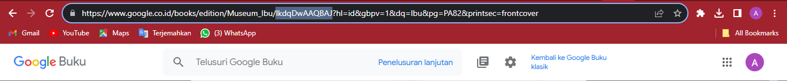
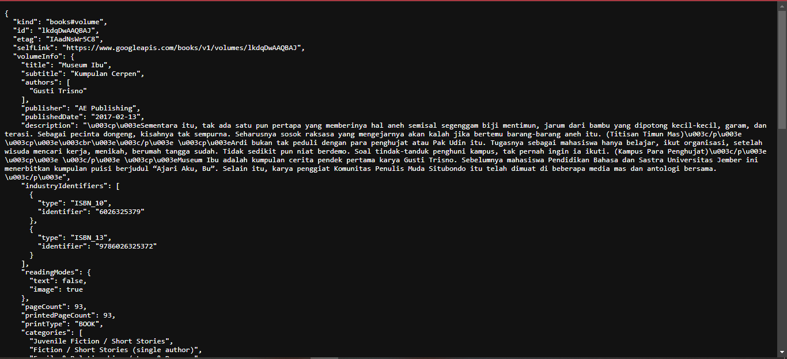

# Jobsheet Week 12 - Ashyncronous

Achmad Aly Abdulloh

2141720039

02

# Praktikum 1: Mengunduh Data dari Web Service (API)

*Soal 2*
- Carilah judul buku favorit Anda di Google Books, lalu ganti ID buku pada variabel path di kode tersebut. Caranya ambil di URL browser Anda seperti gambar berikut ini.

</img>

- Kemudian cobalah akses di browser URI tersebut dengan lengkap seperti ini. Jika menampilkan data JSON, maka Anda telah berhasil. Lakukan capture milik Anda dan tulis di README pada laporan praktikum. Lalu lakukan commit dengan pesan `"W12: Soal 2"`.

</img>

