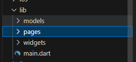
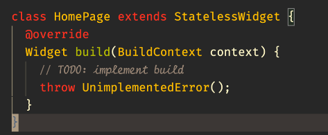
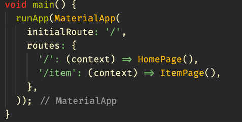
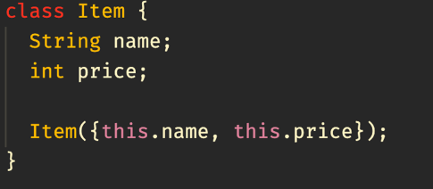
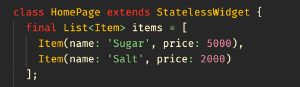
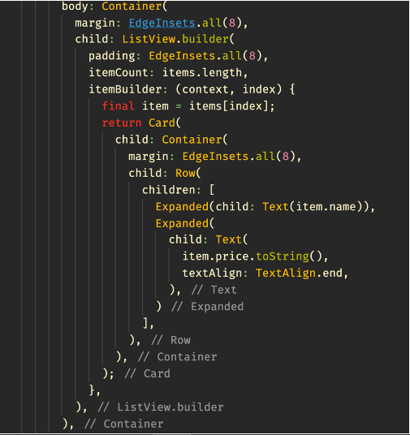
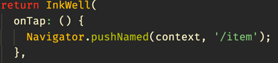
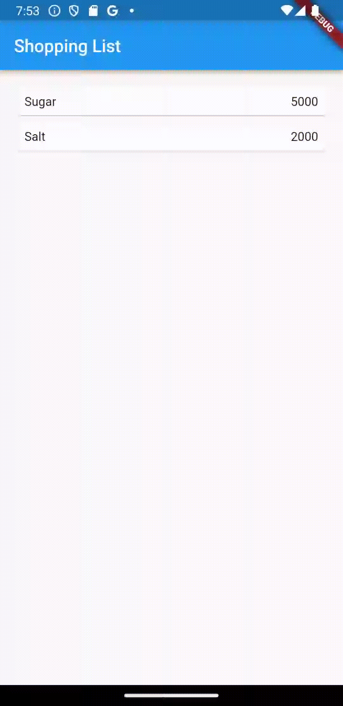
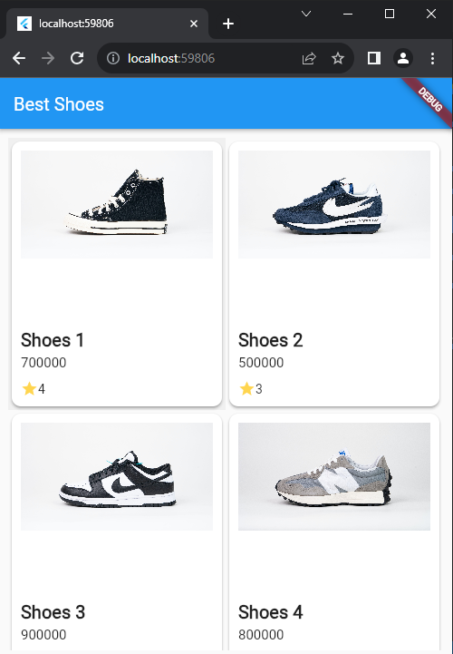
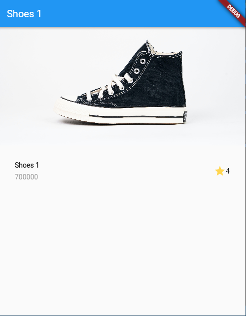

# Konsep Navigasi dan Rute

Nama : Achmad Aly Abdulloh

Nim : 2141720039

Kelas : TI-3A

## Praktikum 5

### Langkah 1: Siapkan project baru

### Langkah 2: Mendefinisikan Route

### Langkah 3: Lengkapi Kode di main.dart

### Langkah 4: Membuat data model

### Langkah 5: Lengkapi kode di class HomePage

### Langkah 6: Membuat ListView dan itemBuilder

### Langkah 7: Menambahkan aksi pada ListView

### Hasil Praktikum :

## Tugas Praktikum 2

### Tampilan List Item

### Tampilan Detail Item
