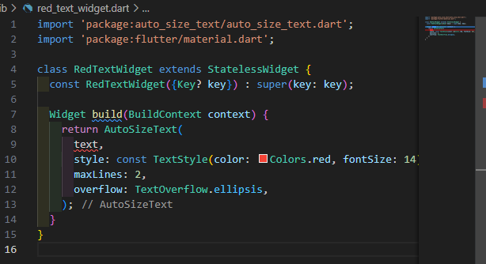

# manajemen_plugins

Nama : Achmad Aly Abdulloh

Nim : 2141720039

No : 02

Kelas : TI-3A

## Praktikum Menerapkan Plugin di Project Flutter

### Langkah 1: Buat Project Baru

### Langkah 2: Menambahkan Plugin

Tambahkan plugin `auto_size_text` menggunakan perintah berikut di terminal

### Langkah 3: Buat file red_text_widget.dart

Buat file baru bernama `red_text_widget.dart` di dalam folder lib lalu isi kode seperti berikut.

    import 'package:flutter/material.dart';

    class RedTextWidget extends StatelessWidget {
    const RedTextWidget({Key? key}) : super(key: key);

    @override
    Widget build(BuildContext context) {
        return Container();
    }
    }

### Langkah 4: Tambah Widget AutoSizeText

Masih di file `red_text_widget.dart`, untuk menggunakan plugin `auto_size_text`, ubahlah kode `return Container()` menjadi seperti berikut.

### Langkah 5: Buat Variabel text dan parameter di constructor

Tambahkan variabel `text` dan parameter di constructor seperti berikut.

### Langkah 6: Tambahkan widget di main.dart

Buka file `main.dart` lalu tambahkan di dalam `children: `pada `class _MyHomePageState`

### Hasil Praktikum :

## Tugas Praktikum

### 2. Jelaskan maksud dari langkah 2 pada praktikum tersebut!

Menambahkan plugin `auto_size_text` pada projek flutter yang sudah dibuat.

### 3. Jelaskan maksud dari langkah 5 pada praktikum tersebut!

menambahkan variable text dan parater text yang nanti digunakan pada `AutoSizeText()`

### 4. Pada langkah 6 terdapat dua widget yang ditambahkan, jelaskan fungsi dan perbedaannya!

pada widget yang pertama dalam container terdapat child yang memanggil class `RedTextWidget()` yang menggunakan plugin `auto_size_text`. sedangkan widget ke dua tidak menggunakan plugin `auto_size_text`.

### 5. Jelaskan maksud dari tiap parameter yang ada di dalam plugin auto_size_text berdasarkan tautan pada dokumentasi ini !

`key` : Mengontrol bagaimana satu widget menggantikan widget lain di tree.

`textKey` : Mengatur key untuk widget Teks yang dihasilkan

`style` : Jika bukan null, style yang akan digunakan untuk teks ini

`minFontSize`: mengatur ukuran minimum text

`stepGranularity` : mengontrol seberapa halus atau besar penyesuaian ukuran teks. Ini adalah nilai dalam piksel yang menentukan perbedaan ukuran teks antara satu tingkatan penyesuaian ukuran dan tingkat penyesuaian ukuran berikutnya. Semakin kecil nilai stepGranularity, semakin halus penyesuaian ukuran teksnya.

`presetFontSizes` : daftar ukuran font yang diizinkan yang dapat digunakan oleh widget AutoSizeText saat menyesuaikan ukuran teks. 

`group` : digunakan untuk mengelompokkan beberapa widget AutoSizeText sehingga mereka dapat berbagi ukuran yang sama saat menyesuaikan teks. Dengan mengelompokkan widget dalam grup yang sama, dapat memastikan bahwa ukuran teks pada widget yang berbeda tetap konsisten.

`textAlign` : digunakan untuk mengatur perataan teks (alignment) di dalam widget. 

`textDirection` : untuk mengontrol arah bacaan teks. Ini memungkinkan Anda untuk mengatur apakah teks ditampilkan dari kiri ke kanan (LTR - left-to-right) atau dari kanan ke kiri (RTL - right-to-left).

`locale` : digunakan untuk menentukan pengaturan regional (locale) yang akan memengaruhi tampilan dan format teks, seperti pengaturan bahasa, format tanggal, dan format angka. Dengan menggunakan parameter locale, Anda dapat mengontrol cara teks ditampilkan sesuai dengan pengaturan regional yang diinginkan.

`softWrap` :digunakan untuk mengontrol apakah teks di dalam widget dapat dibungkus (soft wrap) ke baris berikutnya jika melebihi lebar kotak yang menampilkannya.
Ketika softWrap diatur ke true, teks yang melebihi lebar kotak akan dibungkus secara otomatis ke baris berikutnya sehingga seluruh teks tetap terlihat. Ini memungkinkan teks yang panjang untuk ditampilkan dalam widget tanpa perlu menggulung atau memotong teks.

`wrapWords` :  parameter dalam widget AutoSizeText di Flutter yang mengontrol apakah kata-kata dalam teks dapat dibungkus ke baris berikutnya jika melebihi lebar kotak yang menampilkannya. Ketika wrapWords diatur ke true, teks akan mencoba untuk menghindari memotong kata-kata di tengah dan akan memungkinkan kata-kata untuk dibungkus secara utuh ke baris berikutnya jika mereka melebihi lebar kotak. Ini memastikan bahwa kata-kata tidak dipotong, yang seringkali diinginkan dalam tampilan teks agar tetap mudah dibaca.

`overflow` : parameter dalam widget AutoSizeText di Flutter yang mengontrol perilaku teks ketika teks melebihi batas lebar kotak yang menampilkannya.

`overflowReplacement` : parameter dalam widget AutoSizeText di Flutter yang memungkinkan Anda menentukan widget pengganti yang akan digunakan untuk menggantikan teks yang melebihi batas lebar kotak ketika overflow diatur ke TextOverflow.ellipsis.

    AutoSizeText(
        'Teks yang sangat panjang yang akan digantikan oleh ikon jika melebihi batas kotak.',
        overflow: TextOverflow.ellipsis,
        overflowReplacement: Icon(Icons.more_vert), 
    // Menggantikan tanda titik elipsis dengan ikon
    )

`textScaleFactor` : adalah parameter yang dapat digunakan dalam widget AutoSizeText di Flutter yang mengontrol faktor skala (scaling factor) ukuran teks dalam widget. Parameter ini memungkinkan Anda untuk mengatur skala ukuran teks dalam widget secara proporsional.

`textScaleFactor` : parameter yang umumnya digunakan dalam Flutter untuk mengatur faktor skala (scaling factor) ukuran teks dalam hampir semua widget yang menggunakan teks. Parameter ini digunakan untuk mengubah ukuran teks secara global dalam aplikasi dengan faktor skala tertentu.

`maxLines` : mengatur banyak baris teks yang akan ditampilkan

`semanticsLabel` : parameter dalam widget AutoSizeText di Flutter yang digunakan untuk memberikan label semantik (semantics label) ke teks yang ditampilkan dalam widget. Label semantik adalah teks yang digunakan untuk memberikan informasi tambahan tentang elemen tampilan kepada pembaca layar atau alat bantu aksesibilitas. Ini membantu pengguna dengan disabilitas visual memahami dan berinteraksi dengan konten aplikasi.
